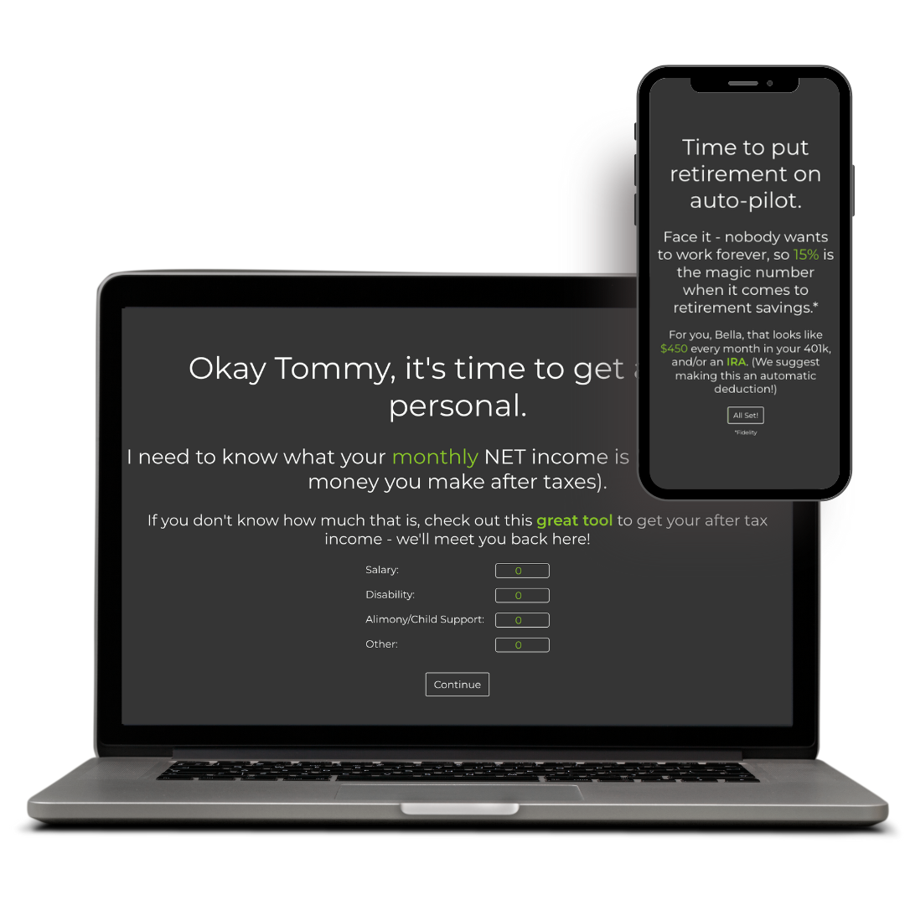

# simpli.money

69% of Americans aren't saving enough to retire - many don't even have enough saved to cover a basic emergency. If you fall into one of these categories, this is a tool for you.

## The Dollars and Sense of it All

I am making this project because I have a passion for helping people make the most out of their hard earned dollars. Oftentimes, I find that I repeat myself a lot when it comes to savings and retirement advice. This tool will be a quick and easy way for someone at ANY point in their financial journey to figure out "what the heck do I do with my money?"

## Getting Started
### Local Machine (command line)
- <code>$npm i</code>
- <code>$npm start</code>

### Browser 
- Simpli navigate to www.simpli.money and the app guides you through the process!

## Technologies Used

For this project, I used: 
- JavaScript
- React
- Redux
- Node
- Less

## What I Learned
- I became much more comfortable with using Redux.
- I learned how to use Redux Toolkit (their docs are incredible!)
- There's no such thing as too many React components!

## List of Key Features at First Launch</h2>
- Use the "simpli path" to figure out where you are in your financial journey and have a plan for what to do next!
- Set up a budget using the budget tool to make sure you are on track each month with finances.

## Plans for Future Updates
- Debt paydown tool
- Ability to log in rather than just storing information in local storage
- Mortgage payment tool
- Investment questionairre with allocation recommendations

